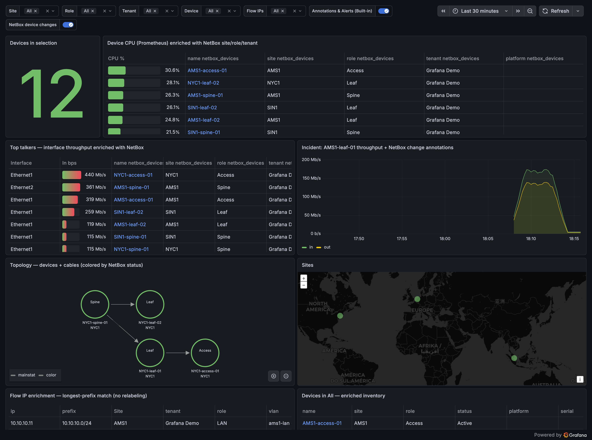

# NetBox data source for Grafana

Enrich your observability data with infrastructure context from [NetBox](https://netboxlabs.com/oss/netbox/).

Most network and infrastructure telemetry arrives as bare identifiers — a device name, an
interface, an IP. NetBox knows what those identifiers *mean*: which site and rack a device
lives in, its role, platform, tenant, serial, lifecycle, the cable on the other end. This
data source brings that context into Grafana so you can **join** it onto metrics and logs
from Prometheus, Loki, Mimir, InfluxDB or anything else — turning `device="leaf1"` into
"leaf1, an Arista switch in DM-Akron, rack R-12, owned by the NetEng team."



## Features

- **Joinable context tables.** Query any NetBox object type and get a flat, table-shaped
  result keyed on `name` / `address` / `device` so Grafana's **Outer join** transformation
  lines NetBox columns up against your metric series.
- **Configurable join keys.** Per query, derive extra key columns (rename + transform:
  lowercase, strip-domain, IP-host, regex) so a NetBox field matches your metric label with
  no extra Grafana transforms. Add several to reuse one query different ways. See
  [docs/JOIN-KEYS.md](./docs/JOIN-KEYS.md).
- **IP enrichment (longest-prefix match).** Resolve arbitrary observed IPs to their
  containing NetBox prefix's site/tenant/role — the one enrichment a value-join can't do.
- **Topology node graph.** Devices + cables as a Grafana node graph, colored by device
  status.
- **Geomap.** Plot sites from their NetBox latitude/longitude.
- **Dynamic object-type discovery.** Object types are discovered from the live NetBox API —
  core models *and* plugin-provided models (e.g. BGP, custom objects) — with no code changes.
- **Template variables.** Drive `site` / `device` / `role` / `tenant` dropdowns from NetBox
  and filter every panel on the dashboard. Multi-value variables become OR filters.
- **Annotations.** Overlay NetBox change-log events (who changed what, when) on any
  time-series panel using Grafana's `time/title/text/tags` convention.
- **Deep links.** Every row links straight back to the NetBox object page — and the link
  survives the join, so an enriched metrics table stays clickable through to NetBox.
- **Secure & backend-based.** API token stored in Grafana's encrypted secret store; all
  upstream calls happen server-side. Works with NetBox **v1 and v2** API tokens.

## Query types

| Type | Returns | Use with |
|------|---------|----------|
| **Objects** | A joinable table for any object type (with optional join keys) | Table, or Outer-join onto metrics |
| **IP enrichment** | Per-IP longest-prefix context, keyed on `ip` | Join onto flow/log data by IP |
| **Topology** | Devices (nodes) + cables (edges) | Node Graph panel |
| **Annotations** | Change-log events (`time/title/text/tags`) | Dashboard annotations |

See [docs/USE-CASES-AND-COVERAGE.md](./docs/USE-CASES-AND-COVERAGE.md) for the full map of
operator use cases and how well each is covered, and [demo/](./demo) for a runnable demo
(synthetic Prometheus labeled to match NetBox + a rich dashboard).

## Requirements

- Grafana **>= 12.3**
- A reachable NetBox instance and an API token

## Configuration

Add the data source (**Connections → Data sources → NetBox**) and set:

| Field | Description |
|-------|-------------|
| **Mode** | `NetBox REST API` (default). `Network Context Service` is reserved for a future release — see [Modes](#modes). |
| **NetBox URL** | Base URL of your NetBox instance, e.g. `https://netbox.example.com` (no trailing `/api`). |
| **API Token** | A NetBox API token. Both classic 40-character (v1) tokens and `nbt_…` (v2) tokens are auto-detected. Stored encrypted. |
| **Skip TLS verify** | Accept self-signed certificates. |
| **Timeout (s)** | Per-request upstream timeout (default 30). |

Click **Save & test** — a healthy data source reports the connected NetBox version.

### Provisioning

```yaml
apiVersion: 1
datasources:
  - name: NetBox
    type: netboxlabs-netbox-datasource
    access: proxy
    jsonData:
      url: ${NETBOX_URL}
      mode: netbox
    secureJsonData:
      apiToken: ${NETBOX_API_TOKEN}
```

## Enrichment recipes

### 1. Join NetBox context onto Prometheus metrics

1. Add your metric query (panel A), e.g. `rate(interface_bytes_in_total[5m])` with a
   `device` label.
2. Add a second query against the **NetBox** data source: object type **Devices**, and in
   **Return fields** pick the join key plus the context you want — e.g. `name`, `site`,
   `role`, `tenant`.
3. In **Transformations**, add **Outer join** (a.k.a. *Join by field*) and set the field to
   the shared key. Name the NetBox key field to match your metric label (`device`).
4. Every metric row now carries its NetBox site/role/tenant — group, filter and color by them.

> Tip: NetBox device names are the most reliable join key. The data source also returns
> `address` (IPAM) so you can join flow/Prometheus series by IP when names aren't available.

### 2. NetBox-driven dashboard variables

Create a variable of type **Query** against the NetBox data source: pick an object type
(e.g. **Sites**), a **Value field** (`slug`) and a **Text field** (`name`). Reference it in
any panel filter as `$site`. Chained variables work too — filter `devices` by `site=$site`.

### 3. Change-log annotations

Add a dashboard annotation against the NetBox data source. Optionally restrict to content
types (`dcim.device`, `ipam.prefix`, …). NetBox changes appear as markers on your panels.

### 4. Deep links

Include the `display_url` column (it can be hidden in the table) and the primary label
column (`name`/`address`) renders as a link to the NetBox object page.

## Alerting

The data source is alerting-capable (`backend: true` + `alerting: true` in `plugin.json`),
so NetBox queries can back **Grafana-managed alert rules**. Alerting itself is native to
Grafana — the data source only supplies query results; alert rules, evaluation, and
notifications are configured in Grafana.

Grafana's alert expressions evaluate a **number**, not a table. A normal object query
returns a table, which alerting rejects (_"input data must be a wide series but got type
long"_). So to alert on NetBox, return a **count**:

1. **New alert rule** → query **A**: data source **NetBox**, query type **Objects**,
   object type e.g. `dcim/devices` (add filters as needed, e.g. `status = offline`), and
   enable **Return count only**. The query now emits a single numeric `count`.
2. Add a **Threshold** expression on **A** (e.g. _IS ABOVE 0_ to fire when any matching
   object exists) and set it as the alert condition.

> The `count` is the **total number of matching objects** reported by NetBox, independent
> of the query's **Limit** — a count-only query fetches a single page and reads the total
> from the API response envelope. To change what's counted, adjust the query's **filters**
> (e.g. `status = offline`); the **Limit** field has no effect on a count-only query.

**Evaluation interval — mind your NetBox load.** Alert rules poll on a schedule, 24/7. In
the default direct-REST mode, every evaluation is a live NetBox API call, so that load
lands on your NetBox instance. A count-only query fetches just one page per evaluation, so
each check is light regardless of how many objects match — the levers on load are the
**evaluation interval** and the **number of rules**. Choose sensible intervals (start at
**1m or longer**, and lengthen for many rules). High-frequency alerting at scale is the
motivation for the managed context backend (zero load on NetBox).

## Dynamic object-type discovery

The query editor's **Object type** list is built by walking the NetBox API
(`/api/` + `/api/plugins/`). Any model exposed by the REST API — including plugins like
`netbox-bgp` — appears automatically. Columns are derived by flattening a sample object, so
nested references become readable values (`site`) plus their ids/slugs (`site_id`,
`site_slug`), choice fields expose both label and value, and custom fields are hoisted to
`cf_*` columns.

## Modes

The data source talks to NetBox through a small provider interface. Today the only
implementation is the **NetBox REST API**. A second mode — the **Network Context Service
(NCS)**, a high-volume enrichment projection of NetBox for NetBox Cloud/Enterprise — is a
planned fast-follow and slots in behind the same interface. See
[ARCHITECTURE.md](./ARCHITECTURE.md).

## Grafana Cloud

This is a **backend** datasource, so it runs on Grafana Cloud once published to the Grafana
plugin catalog and signed by Grafana (Cloud cannot load private/unsigned plugins).

- **Public NetBox** (internet-reachable URL): the Cloud-hosted backend calls it directly.
- **Private NetBox** (VPC / on-prem): use **[Private Data Source Connect (PDC)](https://grafana.com/docs/grafana-cloud/connect-externally-hosted/private-data-source-connect/)**.
  PDC supports backend datasource plugins, and this plugin builds its HTTP client from the
  Grafana SDK (`backend/httpclient`) so PDC's secure tunnel, proxy and TLS settings are
  honored automatically — no plugin changes needed by the customer.

The backend ships binaries for `linux/amd64` and `linux/arm64` (Cloud) plus the full
catalog target matrix (darwin/windows/arm). See [docs/PUBLISHING.md](./docs/PUBLISHING.md)
for the catalog/signing checklist.

## Development

```bash
# Frontend
npm install
npm run dev            # watch build
npm run test:ci        # jest
npm run typecheck
npm run lint

# Backend (Go)
mage -v build:backend  # or: GOOS=… GOARCH=… go build -o dist/gpx_netbox_<os>_<arch> ./pkg
go test ./...

# Run a dev Grafana with the plugin
NETBOX_URL=https://netbox.example.com NETBOX_API_TOKEN=… docker compose up
```

The Go toolchain floor follows the Grafana plugin SDK (currently Go 1.26 / SDK 0.292). If
your local Go is older, build the backend in a container:

```bash
docker run --rm -v "$PWD":/src -w /src -e GOOS=linux -e GOARCH=amd64 \
  golang:1.26 go build -o dist/gpx_netbox_linux_amd64 ./pkg
```

## Testing

- **Go** (`go test ./...`): provider discovery/flattening/query/changes against a mock
  NetBox, frame typing & data links, QueryData, resource routes, health.
- **Frontend** (`npm run test:ci`): variable mapping, template interpolation, query gating.
- **E2E** (`npm run e2e`): `@grafana/plugin-e2e` (Playwright) config & query editor smoke.

## License

Apache-2.0. See [LICENSE](./LICENSE).
