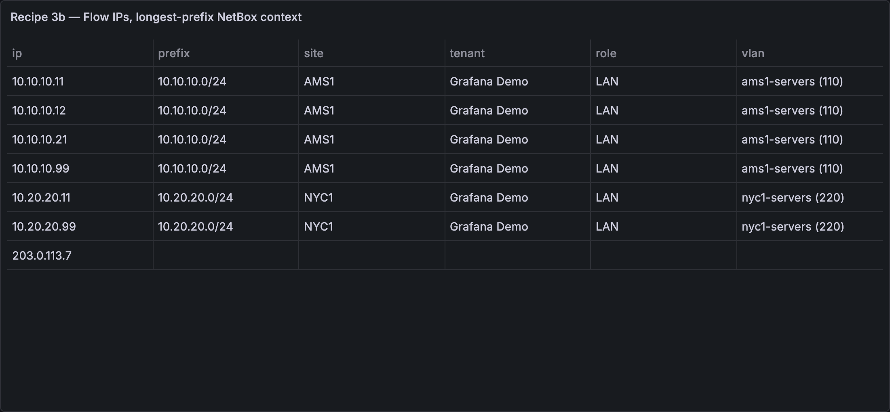

# Enrichment recipes

Step-by-step patterns for joining NetBox context onto metrics, logs and flows.

**How enrichment works.** A NetBox query returns a flat table (one row per
device/IP/prefix). A **join key** renames one NetBox field into a column that exactly
matches a label on your metrics or logs — same name, same value — optionally transforming
it on the way (lowercase, strip domain, drop CIDR mask, regex). A Grafana transformation —
usually **Join by field** — then lines the two tables up, and every series row carries its
NetBox context. Full transform reference:
[JOIN-KEYS.md](./JOIN-KEYS.md).

> Want a sandbox with everything pre-wired? See the [Demo](../README.md#demo) —
> `./demo/run.sh` brings up a real NetBox plus Prometheus, Loki and synthetic telemetry, all
> labeled to match.

## Recipe 1 — Enrich Prometheus/SNMP metrics with site, role and tenant

**You need:** a Prometheus (or any SQL/TSDB) datasource whose series carry a device
identifier label (here: `instance`), and this plugin connected to your NetBox.

**Steps:**

1. Create a table panel. Query **A** (Prometheus): your metric, e.g.
   `device_cpu_percent`, with **Format = Table** and **Instant** enabled.
2. Add query **B** with the **NetBox** datasource: query type **Objects**, object type
   **Devices** (`dcim/devices`). In **Return fields** pick `name`, `site`, `role`,
   `tenant`, and set **Limit** to cover your fleet (e.g. 1000).
3. Still in query B, add a **Join key**: source `name` → output `instance`, transform
   **strip domain** (`leaf1.dc1.corp` → `leaf1`). The output name must equal your metric
   label exactly.
4. In **Transformations**, add **Join by field**: mode **Outer**, field `instance`.
5. Add **Filter data by values** → keep rows where `Value` **is not null** (drops NetBox
   devices with no metrics), then **Organize fields** and hide `Time`, `name`, and any
   leftover label columns (`__name__`, `job`, …) so only `instance`, `Value`, `site`,
   `role`, `tenant` remain.

**Expected result:**

| instance          | Value | site      | role          | tenant         |
| ----------------- | ----- | --------- | ------------- | -------------- |
| dmi01-akron-rtr01 | 38.2  | DM-Akron  | Router        | Dunder-Mifflin |
| dmi01-albany-sw01 | 21.7  | DM-Albany | Access Switch | Dunder-Mifflin |

**If it doesn't match:** your series may use a different label (`device`, `node`) — set
the join key _output_ to that name instead. Case mismatches (`LEAF1` vs `leaf1`) →
transform **lowercase**. All transforms:
[JOIN-KEYS.md](./JOIN-KEYS.md).

## Recipe 2 — Enrich Loki logs with device context

**You need:** a Loki datasource whose streams carry a hostname label (here: `host`).

**Steps:**

1. Create a table panel. Query **A** (Loki): a metric query over your logs, e.g.
   `sum by (host) (count_over_time({job="syslog"}[15m]))`, query type **Instant**.
2. Add query **B** (NetBox): **Objects** → **Devices** (`dcim/devices`); Return fields
   `name`, `site`, `role`, `tenant`; **Limit** e.g. 1000; **Join key** `name` → `host`,
   transform **strip domain**.
3. **Transformations:** add **Labels to fields**, then **Merge series/tables** (Loki
   returns one frame per host; _merge_ correlates them with the NetBox rows on the
   shared `host` column — don't use _Join by field_ here), then
   **Filter data by values** → keep where the log-count column **is not null**, then
   **Organize fields**: hide `Time` and `name`, and rename the log-count column to
   `Log lines (15m)`. Grafana names that column `Value #A` (after the Loki query's
   refId) — pick whatever it shows in the field dropdown; it will not be plain `Value`
   the way a single Prometheus query is.

**Expected result:**

| Log lines (15m) | host              | site     | role   | tenant         |
| --------------- | ----------------- | -------- | ------ | -------------- |
| 42              | dmi01-akron-rtr01 | DM-Akron | Router | Dunder-Mifflin |

(Column order follows the merge; drag fields in **Organize fields** to taste.)

Now group noisy hosts by site or filter the log volume table to one tenant.

**If it doesn't match:** label named `hostname`/`instance` → change the join key output;
logs carry FQDNs but NetBox has short names → keep **strip domain**; the reverse →
apply a regex transform instead
([JOIN-KEYS.md](./JOIN-KEYS.md)).

## Recipe 3 — Enrich flows or logs by IP

Two variants: **exact** (the observed IP exists in NetBox IPAM) and **longest-prefix**
(any IP — resolved to its containing prefix's context). Start with exact; switch when
you see empty joins.

**You need:** any datasource whose rows carry bare IP labels/fields (flow collector,
firewall or DNS logs, …) and this plugin connected to your NetBox.

**3a — exact IP join**

1. Query **A** (your flow datasource): a table of flows keyed by IP, e.g. Prometheus
   `topk(15, rate(flow_bytes_total[5m]) * 8)` with labels `src_ip`, `dst_ip`, with
   **Format = Table** and **Instant** enabled.
2. Query **B** (NetBox): **Objects** → **Ip Addresses** (`ipam/ip-addresses`); Return
   fields `address`, `tenant`, `description`; **Limit** e.g. 1000; **Join key**
   `address` → `src_ip`, transform **IP host** (drops the `/24` mask so
   `10.112.128.1/24` matches the label `10.112.128.1`).
3. **Transformations:** **Join by field** (Outer) on `src_ip`, then
   **Filter data by values** → `Value` **is not null**, then **Organize fields**: hide
   `Time`, `address`, `ip`, `job`, `instance`, rename `Value` → `bps`.

**Expected result:**

| src_ip        | dst_ip      | bps        | tenant         | description  |
| ------------- | ----------- | ---------- | -------------- | ------------ |
| 10.112.128.1  | 10.113.1.7  | 48,200,113 | Dunder-Mifflin | rtr01 uplink |
| 10.112.129.10 | 203.0.113.7 | 9,881,220  | Dunder-Mifflin |              |

**3b — longest-prefix match (works for any IP)**

Exact joins fail for IPs that aren't individually registered in IPAM. The
**IP enrichment** query type instead finds each IP's longest containing prefix:

1. Create a dashboard variable `flow_ips` (type **Query**, your flow datasource), e.g.
   Prometheus `label_values(flow_bytes_total, dst_ip)`. Enable **Multi-value** +
   **Include All**.
2. Add a NetBox query: query type **IP enrichment**; in **IPs** enter
   `${flow_ips:csv}`; pick context fields (`prefix`, `site`, `tenant`, `role`, `vlan`).
   On **NetBox 4.2+** a prefix's site moved to a generic scope — pick `scope` instead of
   `site` (it carries the site name).
3. The result is a table keyed by `ip` — use it standalone, or **Join by field** on `ip`
   against your flow table (rename the flow label to `ip` with an _organize fields_
   transform, or set a join key output accordingly).

**Expected result:**

| ip           | prefix          | site     | tenant         | role | vlan |
| ------------ | --------------- | -------- | -------------- | ---- | ---- |
| 10.112.128.9 | 10.112.128.0/24 | DM-Akron | Dunder-Mifflin | LAN  | 128  |
| 203.0.113.7  |                 |          |                |      |      |

An empty row means NetBox has no containing prefix — that's signal too (unknown/external
traffic).

**If it doesn't match:** exact join (3a) returning mostly empty context → your observed
IPs aren't individually registered in IPAM; switch to 3b. Longest-prefix rows all empty →
the containing prefixes aren't in NetBox, or the variable is empty (check its
`label_values(...)` query returns IPs). Mask/format mismatches → see the transform
reference in
[JOIN-KEYS.md](./JOIN-KEYS.md).

## Beyond joins

- **Dashboard variables:** variable type **Query** → NetBox datasource → object type
  (e.g. _Sites_), value field `slug`, text field `name`. Chain them
  (`devices` filtered by `site=$site`) and reference as `$site` in any panel.
- **Change annotations:** add a dashboard annotation backed by NetBox; optionally
  restrict to content types (`dcim.device`, `ipam.prefix`). Change-log events overlay
  your panels with who-changed-what.
- **Deep links:** include the `display_url` column (hideable) and the primary label
  column links each row back to its NetBox object page — links survive joins.
