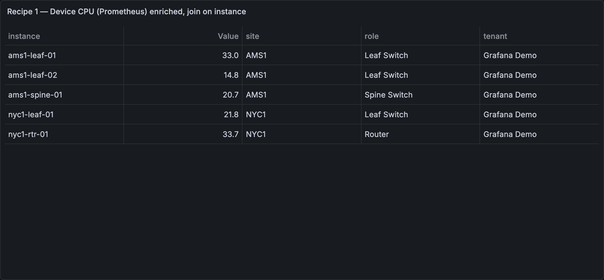
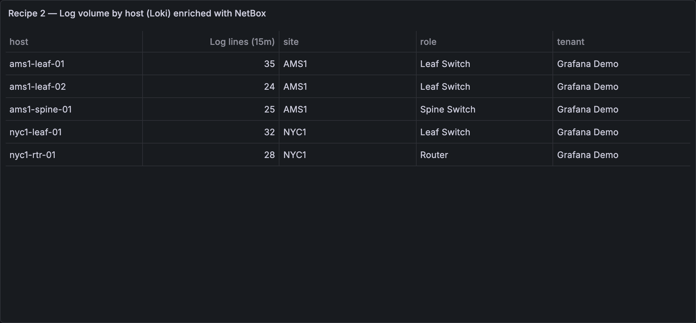
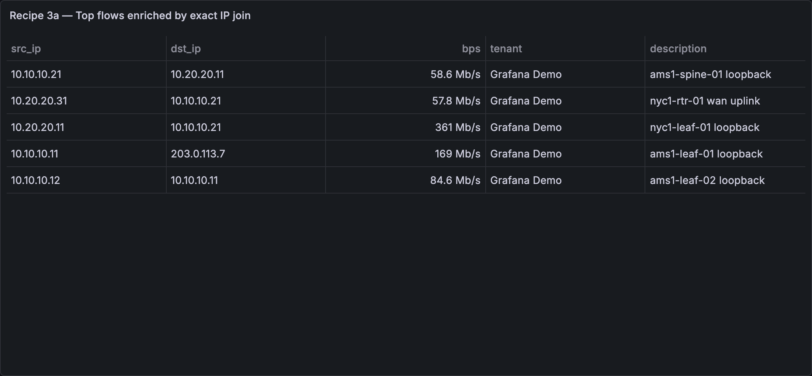
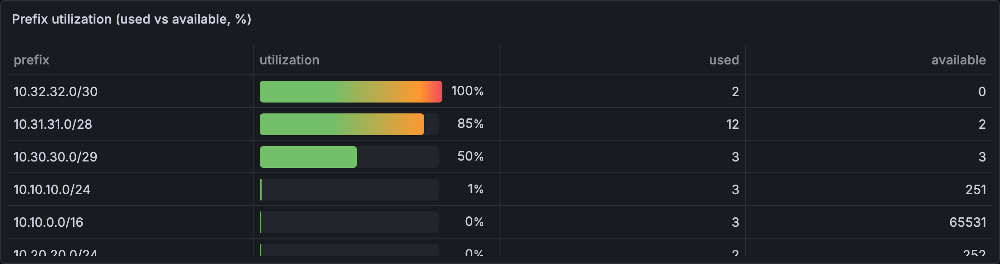

# Enrichment recipes

Step-by-step patterns for joining NetBox context onto metrics, logs and flows.

**How enrichment works.** A NetBox query returns a flat table (one row per
device/IP/prefix). A **join key** renames one NetBox field into a column that exactly
matches a label on your metrics or logs (same name, same value), optionally transforming
it on the way (lowercase, strip domain, drop CIDR mask, regex). A Grafana transformation,
usually **Join by field**, then lines the two tables up, and every series row carries its
NetBox context. Full transform reference:
[JOIN-KEYS.md](./JOIN-KEYS.md).

> Want a sandbox with everything pre-wired? See the [Demo](../README.md#demo):
> `./demo/run.sh` brings up a real NetBox plus Prometheus, Loki and synthetic telemetry, all
> labeled to match.

## Recipe 1: Enrich Prometheus/SNMP metrics with site, role and tenant



**You need:** a Prometheus (or any SQL/TSDB) datasource whose series carry a device
identifier label (here: `instance`), and this plugin connected to your NetBox.

**Steps:**

1. Create a table panel. Query **A** (Prometheus): your metric, e.g.
   `device_cpu_percent`, with **Format = Table** and **Instant** enabled.
2. Add query **B** with the **NetBox** datasource: query type **Objects**, object type
   **Devices** (`dcim/devices`). In **Return fields** pick `name`, `site`, `role`,
   `tenant`, and set **Limit** to cover your fleet (e.g. 1000).
3. Still in query B, add a **Join key**: source `name` → output `instance`, transform
   **strip domain** (`leaf1.dc1.corp` → `leaf1`). The output name must equal your metric
   label exactly.
4. In **Transformations**, add **Join by field**: mode **Outer**, field `instance`.
5. Add **Filter data by values** → keep rows where `Value` **is not null** (drops NetBox
   devices with no metrics), then **Organize fields** and hide `Time`, `name`, and any
   leftover label columns (`__name__`, `job`, …) so only `instance`, `Value`, `site`,
   `role`, `tenant` remain.

**Expected result:**

| instance          | Value | site      | role          | tenant         |
| ----------------- | ----- | --------- | ------------- | -------------- |
| dmi01-akron-rtr01 | 38.2  | DM-Akron  | Router        | Dunder-Mifflin |
| dmi01-albany-sw01 | 21.7  | DM-Albany | Access Switch | Dunder-Mifflin |

**If it doesn't match:** your series may use a different label (`device`, `node`): set
the join key _output_ to that name instead. Case mismatches (`LEAF1` vs `leaf1`) →
transform **lowercase**. All transforms:
[JOIN-KEYS.md](./JOIN-KEYS.md).

## Recipe 2: Enrich Loki logs with device context



**You need:** a Loki datasource whose streams carry a hostname label (here: `host`).

**Steps:**

1. Create a table panel. Query **A** (Loki): a metric query over your logs, e.g.
   `sum by (host) (count_over_time({job="syslog"}[15m]))`, query type **Instant**.
2. Add query **B** (NetBox): **Objects** → **Devices** (`dcim/devices`); Return fields
   `name`, `site`, `role`, `tenant`; **Limit** e.g. 1000; **Join key** `name` → `host`,
   transform **strip domain**.
3. **Transformations:** add **Labels to fields**, then **Merge series/tables** (Loki
   returns one frame per host, and _merge_ correlates them with the NetBox rows on the
   shared `host` column; don't use _Join by field_ here), then
   **Filter data by values** → keep where the log-count column **is not null**, then
   **Organize fields**: hide `Time` and `name`, and rename the log-count column to
   `Log lines (15m)`. Grafana names that column `Value #A` (after the Loki query's
   refId), so pick whatever it shows in the field dropdown: it will not be plain `Value`
   the way a single Prometheus query is.

**Expected result:**

| Log lines (15m) | host              | site     | role   | tenant         |
| --------------- | ----------------- | -------- | ------ | -------------- |
| 42              | dmi01-akron-rtr01 | DM-Akron | Router | Dunder-Mifflin |

(Column order follows the merge; drag fields in **Organize fields** to taste.)

Now group noisy hosts by site or filter the log volume table to one tenant.

**If it doesn't match:** label named `hostname`/`instance` → change the join key output;
logs carry FQDNs but NetBox has short names → keep **strip domain**; the reverse →
apply a regex transform instead
([JOIN-KEYS.md](./JOIN-KEYS.md)).

## Recipe 3: Enrich flows or logs by IP

Two variants: **exact** (the observed IP exists in NetBox IPAM) and **longest-prefix**
(any IP, resolved to its containing prefix's context). Start with exact; switch when
you see empty joins.

**You need:** any datasource whose rows carry bare IP labels/fields (flow collector,
firewall or DNS logs, …) and this plugin connected to your NetBox.

**3a: exact IP join**



1. Query **A** (your flow datasource): a table of flows keyed by IP, e.g. Prometheus
   `topk(15, rate(flow_bytes_total[5m]) * 8)` with labels `src_ip`, `dst_ip`, with
   **Format = Table** and **Instant** enabled.
2. Query **B** (NetBox): **Objects** → **Ip Addresses** (`ipam/ip-addresses`); Return
   fields `address`, `tenant`, `description`; **Limit** e.g. 1000; **Join key**
   `address` → `src_ip`, transform **IP host** (drops the `/24` mask so
   `10.112.128.1/24` matches the label `10.112.128.1`).
3. **Transformations:** **Join by field** (Outer) on `src_ip`, then
   **Filter data by values** → `Value` **is not null**, then **Organize fields**: hide
   `Time`, `address`, `ip`, `job`, `instance`, rename `Value` → `bps`.

**Expected result:**

| src_ip        | dst_ip      | bps        | tenant         | description  |
| ------------- | ----------- | ---------- | -------------- | ------------ |
| 10.112.128.1  | 10.113.1.7  | 48,200,113 | Dunder-Mifflin | rtr01 uplink |
| 10.112.129.10 | 203.0.113.7 | 9,881,220  | Dunder-Mifflin |              |

**3b: IP enrichment (works for any IP)**

Exact joins fail for IPs that aren't individually registered in IPAM. The
**IP enrichment** query type resolves each IP to whatever NetBox does know about
it — the address record, its interface and owning device, or failing that the
longest containing prefix:

1. Create a dashboard variable `flow_ips` (type **Query**, your flow datasource), e.g.
   Prometheus `label_values(flow_bytes_total, dst_ip)`. Enable **Multi-value** +
   **Include All**.
2. Add a NetBox query: query type **IP enrichment**; in **IPs** enter
   `${flow_ips:csv}`; pick context fields. Which columns come back populated for a given
   IP depends on what NetBox actually knows about that address — per row, it's always
   exactly one of three outcomes, never a mix:
   - **The IP is a registered address assigned to a device interface** (e.g. a loopback
     or a routed interface): `address_*` (`address_dns_name`, …), `interface_name`,
     `is_primary_ip` and `device_*` (`device_name`, `device_site`, …) populate.
     `prefix_*` stays blank — the device hop already answered the question a prefix
     lookup would.
   - **The IP is a registered address not assigned to any interface, or assigned to a VM
     interface** (VMs have no NetBox device): `address_*` populates (plus `interface_name`
     and `vm_name` for the VM case), but `device_*` stays blank — there's no device to
     attach — and `prefix_*` still stays blank; a matched address record never falls
     through to the prefix lookup. The virtual machine itself **is** named, in `vm_name`,
     which is in the default field selection for exactly that reason: without it a
     VM-assigned row would have no owner column at all. It is a column of its own rather
     than a value folded into `device_name` on purpose — NetBox lets a device and a
     virtual machine share a name, so folding the two together would make the
     `device_name` → metric `device` join in step 4 match the wrong host. `vm_name` and
     `device_name` are mutually exclusive per row. There is no other `vm_*` column: a
     VM's cluster, site, role, platform and status each cost a second NetBox request,
     whereas the name is already inside the address record and so is free.
     `is_primary_ip` is the one VM fact worth that second request, and it is not a
     `vm_*` column because it is not a VM-only fact: NetBox gives a virtual machine
     `primary_ip4`/`primary_ip6` exactly as it gives a device them, so the flag answers
     on a VM row as readily as on a device row.
     NetBox also lets an address be assigned to something that is not an
     interface at all — an **FHRP/VRRP group**, say — and `interface_*` stays blank for
     those: there is no interface to name. `address_*` still populates, because the
     address record itself is real. That leaves an FHRP-assigned address and a wholly
     unassigned one looking identical (`interface_*` and `device_*` both blank on
     either) — add `address_assigned_object_type` to tell them apart: it carries
     NetBox's raw relation string (`dcim.interface`, `virtualization.vminterface`,
     `ipam.fhrpgroup`), blank meaning unassigned. Read that blank **only against a row
     that matched an address record** — a row in the third outcome below matched none,
     so every `address_*` column is blank there too, this one included. `address_status`
     is the discriminator: populated ⇒ a record matched ⇒ blank really does mean
     "assigned to nothing". See `address_assigned_object_type` below for why this is the
     only signal that finds a VRRP/HSRP virtual address — `match_count` does not.
   - **The IP matches no address record at all**: only then does the query fall back to
     the longest-**containing** prefix, populating `prefix_cidr`, `prefix_scope`,
     `prefix_tenant`, `prefix_role`, `prefix_vlan`. `address_*`/`interface_*`/`device_*`
     stay blank. There is no `prefix_site`: NetBox 4.2 replaced a prefix's `site` with a
     generic **scope** (a site, a region or a location), surfaced here as `prefix_scope`
     — it carries the site name for a site-scoped prefix. That replacement is also why
     4.2 is the supported floor; see [Requirements](../README.md#requirements).

   **Selecting fields is also a performance choice.** Each group of columns costs the
   lookup that fills it, and a group you don't select is not looked up. That matters most
   for `prefix_*`: NetBox's `?contains=` takes one address at a time, so the fallback is
   one lookup per IP with no address record and cannot be batched. Eight run at once,
   which shortens the wait but not the work: a 1,000-IP panel of external addresses is
   1,000 requests, and at NetBox Cloud's ~0.35 s per request that is still around 45 s.
   A value that is not an address is not looked up. The default field
   selection contains no `prefix_*` column and therefore makes no prefix request at all;
   add one only when you want prefix context. `device_*` costs one extra batched request
   for the whole IP list. `is_primary_ip` costs up to two: the same device request (shared
   if you selected `device_*` anyway) plus a batched virtual-machine request, because a
   VM's primary address — unlike its name — is not carried inside the address record.
   Both are gated on the column: a query that doesn't select it asks NetBox about no
   virtual machine at all.

3. The result is a table keyed by `ip`. Use it standalone, or **Join by field** on `ip`
   against your flow table (rename the flow label to `ip` with an _organize fields_
   transform, or set a join key output accordingly).
4. To carry the flow through to the **device's own metrics**, add a second target on the
   same panel (set the panel datasource to **-- Mixed --**) and join on the device name.
   The enrichment's `device_name` is NetBox's device name, and that is what
   device/interface metrics are labelled with:

   - Add a Prometheus target, e.g. `device_cpu_percent` (format **Table**, **Instant**).
     In the bundled demo it carries `device="AMS1-leaf-01"`, and so do `device_up`,
     `interface_oper_up` and `interface_in_octets_total`.
   - On the NetBox target, add a **Join key**: source `device_name`, output `device`
     (transform **none**). That renames the column to match the metric's label.
   - Add a **Join by field** transform on `device`, mode **outer**.

   Verified against the bundled demo: all 10 `flow_bytes_total` `src_ip` values resolve to
   a `device_name` that is present in Prometheus's `device` label — a 10/10 join.

   **Your exporter may not label by NetBox's device name.** A real SNMP exporter typically
   labels by `sysName`, an FQDN, or the polled management address, and none of those has to
   equal the NetBox name. Check first with `label_values(<your metric>, device)` (or
   `instance`). If the values differ only in form, bridge them with a join-key transform
   rather than renaming anything in NetBox: **lowercase** for case differences, **strip
   domain** for `leaf01.dc.example.com` → `leaf01`, or **regex** for anything else — see
   [JOIN-KEYS.md](./JOIN-KEYS.md). If your exporter labels by management IP instead, join
   on `ip` (see the note on `is_primary_ip` below).

**Expected result** (real `ds/query` response against the bundled demo NetBox, contrasting
all three outcomes):

| ip          | address_dns_name   | device_name  | vm_name    | is_primary_ip | interface_name | prefix_cidr   | prefix_scope | prefix_tenant | prefix_role | prefix_vlan    |
| ----------- | ------------------ | ------------ | ---------- | ------------- | -------------- | ------------- | ------------ | ------------- | ----------- | -------------- |
| 10.20.0.1   | leaf01.example.net | AMS1-leaf-01 |            | true          | Ethernet1      |               |              |               |             |                |
| 10.40.0.5   |                    |              | demo-vm-01 | true          | eth0           |               |              |               |             |                |
| 10.10.10.50 |                    |              |            |               |                | 10.10.10.0/24 | AMS1         | Grafana Demo  | LAN         | ams1-lan (110) |

`10.20.0.1` is AMS1-leaf-01's primary IP on `Ethernet1` — a registered, interface-assigned
address, so `address_*`/`interface_*`/`device_*` populate and `prefix_*` stays blank;
`vm_name` is blank because a device is not a virtual machine. `10.40.0.5` is a VM's `eth0`
— a registered address with no owning NetBox device, so `interface_name` and `vm_name`
populate but `device_*` (and `prefix_*`) don't. The two name columns are exactly the
contrast: each row is named, and which column names it tells you which model NetBox holds
it in. `is_primary_ip` is `true` on **both** of those rows, which is why it carries no
`device_` prefix: 10.40.0.5 is `demo-vm-01`'s `primary_ip4` in NetBox in precisely the
sense that 10.20.0.1 is AMS1-leaf-01's. `10.10.10.50` has no address record at all, so
the query falls back to the containing prefix (`10.10.10.0/24`) and every
address/device/interface column is blank — `is_primary_ip` included, since a row that
found no owner has nothing to be the primary address of.
An IP matching neither an address record nor a containing prefix comes back with every
context column blank — signal too (unknown/external traffic).

**Three signals worth knowing about:**

- **`is_primary_ip`** — whether this address is the primary IP of whatever owns it: the
  one NetBox designates as that host's management address, and therefore the one an SNMP
  poller configured from NetBox would be pointed at. It tells you _which_ of a host's
  several addresses this row is, which matters when a host appears more than once in a
  flow table.

  It answers for **devices and virtual machines alike**, and that is why it carries no
  namespace: NetBox gives `dcim.device` and `virtualization.virtualmachine` the same
  `primary_ip4`/`primary_ip6` pair, so a `device_` prefix would be a lie on every VM row.

  **Blank does not mean "not primary."** `false` means this address is not its owner's
  primary — which includes the common case of an owner NetBox holds no primary for at all
  (3 of the 15 devices in the bundled demo are in exactly that state). Blank means the
  question does not apply to this row, and
  there are three ways to get one: the IP matched no address record (the prefix-fallback
  outcome — no owner was ever reached); the address is assigned to nothing; or the address
  is assigned to an **FHRP/VRRP group**. That last one is the case worth knowing, because
  it is blank for a reason the other columns don't share: NetBox has no primary-IP concept
  for FHRP groups _at all_. An `ipam.fhrpgroup` **holds** addresses — `ip_addresses` is a
  list — and never elects one of them as primary; the model has no `primary_*` field of
  any kind (verified against NetBox 4.4.10's schema). So the column is left empty there
  rather than answering `false` to a question NetBox never asks. Filter accordingly: to
  find "registered, and not the management address", the test is `is_primary_ip == false`
  — `is not true` sweeps in every FHRP row and every unresolved IP alongside it.

  The whole value space, from one query against the bundled demo NetBox:

  | ip          | owner                     | address_assigned_object_type | is_primary_ip |
  | ----------- | ------------------------- | ---------------------------- | ------------- |
  | 10.20.0.1   | AMS1-leaf-01 (device)     | dcim.interface               | true          |
  | 10.40.0.5   | demo-vm-01 (VM)           | virtualization.vminterface   | true          |
  | 10.40.0.6   | demo-vm-01 (VM)           | virtualization.vminterface   | false         |
  | 10.50.0.1   | demo-vrrp-42 (FHRP group) | ipam.fhrpgroup               |               |
  | 10.10.10.50 | none — prefix fallback    |                              |               |

  The last two rows are the ones to read carefully: both are blank, and neither blank is a
  failed lookup. `10.50.0.1` resolved perfectly — NetBox simply has no primary IP to report
  for a VRRP group — while `10.10.10.50` never found an owner to ask. If a genuine failure
  had blanked the column, the frame would carry a warning notice saying so; blank on its own
  is never evidence of one.

  It is **not** itself a join key, and the useful join does not go through it. Whether you
  can join on the IP at all depends on your exporter: only if it labels series with the
  polled address (`instance="10.20.0.1"` or similar) is there anything for `ip` to match.
  The bundled demo's exporter does not — no metric on any device or interface carries an
  IP-shaped value on `device`, `instance`, `interface` or `job` — so on this stack the
  device-name join in step 4 is the one that works. Check your own with
  `label_values(<your metric>, instance)` before designing around either.

- **`match_count`** — how many NetBox address records matched the IP, before the row you
  see was picked. `1` is the normal case. `> 1` means NetBox genuinely holds several
  address records for that host — an anycast address registered once per device, or a
  virtual IP recorded separately on each member interface; the plugin picks one match
  deterministically so the row is stable across queries, but a count above 1 is your cue
  that "the device" isn't unique for that address.

  It is **not** a VRRP/HSRP detector. When a virtual address is modelled the way modern
  NetBox intends — one address record assigned to an **FHRP group**, with the redundant
  interfaces as members of that group — there is only ever one record, so `match_count` is
  `1` and nothing here distinguishes it. Use `address_assigned_object_type` for that; see
  below.

  The pick, in order: a record **assigned to an interface** (device or VM) wins, then one
  assigned to **anything else** (an FHRP/VRRP group, say), then a **non-deprecated**
  status, then the **lowest NetBox id**. Interface assignment comes first because it is
  the only kind that can fill `interface_*` and `device_*` at all — a VRRP group record
  can describe the address but can never name a port or a device, so preferring it would
  hand you a blank row while the answer sat in the other record. Assignment outranks
  status for the same reason: a deprecated interface record still names the device, and
  `address_status` shows you it's deprecated.

- **`address_assigned_object_type`** — what the address record is assigned to, as
  NetBox's own raw relation string: `dcim.interface`, `virtualization.vminterface`, or
  `ipam.fhrpgroup`. Blank means unassigned — but blank is not _self_-evidence of that, and
  the difference matters when you build an alert on it. Three different situations all
  leave it empty: an address record that really is assigned to nothing; an IP that matched
  no address record at all, which never reaches this column; and an IP whose address lookup
  partially failed, which degrades and raises a WARNING notice on the frame. Only the first
  is "NetBox says nothing owns this". Pair it with `address_status` — populated ⇒ a record
  matched — and heed the frame notices, which for a degraded query say exactly which
  columns are blank for a reason the data cannot show. This column, **not** `match_count`,
  is the signal for a **VRRP/HSRP virtual address**. The two look like they should overlap
  and don't: a virtual address is shared across a redundant pair much as an anycast address
  is shared across several devices, but NetBox models it as a single address record
  assigned to an FHRP group — the redundant interfaces are members of the _group_, not
  separate address records — so `match_count` is **1**, exactly like an ordinary address.
  (Verified: an FHRP-assigned address returns `match_count = 1`.) `match_count` rises only
  when NetBox genuinely holds several address records for the same host, which is the
  anycast/duplicate case. Meanwhile the FHRP row leaves `interface_*` and `device_*` blank —
  there is no port or device to name a virtual-group address with — so on its own it looks
  exactly like an address NetBox has no record of. `address_assigned_object_type` reading
  `ipam.fhrpgroup` is the only thing that tells those apart; an alert or dashboard that
  keys on `match_count > 1` to find virtual addresses will miss every one of them.
  It's offered rather than defaulted: most rows are blank or `dcim.interface`, so it
  earns a column only when the VRRP/HSRP case is actually in play.

**If it doesn't match:** exact join (3a) returning mostly empty context → your observed
IPs aren't individually registered in IPAM; switch to 3b. Longest-prefix rows all empty →
the containing prefixes aren't in NetBox, or the variable is empty (check its
`label_values(...)` query returns IPs). Mask/format mismatches → see the transform
reference in
[JOIN-KEYS.md](./JOIN-KEYS.md).

> **In an alert rule** there is no variable to feed the IPs in. Use the query's
> **NetBox scope** source instead — every address under a prefix, VRF or tenant —
> and join the metric's IP against it in a SQL expression:
> [Alerts on IP-only metrics](alerting/ip-only-metrics.md).

## Prefix & IP utilization

Prefixes and IP ranges expose three extra columns: `utilization` (percent used, 0 to
100), `used`, and `available`. The backend computes them to match the figure shown in
NetBox's own UI (network/broadcast excluded for IPv4 non-pool prefixes, container
prefixes measured by child-prefix coverage, `mark_utilized` ⇒ 100%).

They are opt-in: they appear only when you add them to **Return fields**, so ordinary
IPAM queries pay no extra cost.



**Steps:**

1. Add a panel with query type **Objects**, object type **Prefixes** (`ipam/prefixes`) or
   **Ip Addresses → IP ranges** (`ipam/ip-ranges`). Add filters as usual (e.g. `site`,
   `tenant`, `role`).
2. In **Return fields**, pick `prefix` (or `start_address`) plus `utilization`, `used`,
   `available`.
3. Visualize: a **Gauge** or **Bar gauge** on `utilization` with thresholds (e.g. green < 75,
   red ≥ 90) shows capacity per subnet. A **Table** with all three columns gives the raw
   numbers, sorted by `utilization` to surface the fullest subnets.

**Expected result** (Table):

| prefix        | utilization | used | available |
| ------------- | ----------- | ---- | --------- |
| 10.10.10.0/24 | 1           | 3    | 251       |
| 10.20.20.0/24 | 0           | 2    | 252       |

**Notes:** utilization is scoped to the object's VRF and mirrors NetBox's own figure. A
leaf prefix's `used` is the de-duplicated set of its child IP addresses plus any
marked-utilized child ranges, a container prefix is measured by child-prefix coverage,
and an IP range by its child-IP count. It's computed only when a utilization field is
requested (a few extra NetBox calls per row), so ordinary IPAM queries are unaffected.

## Joining in a SQL expression

The recipes above join in the browser, with a panel transformation. A Grafana
**SQL expression** runs the same join on the server instead, which is what you
want when nothing is going to run a transformation: a backend that posts a
dashboard's queries to `/api/ds/query`, or an alert rule (that case has a page of
its own, [NetBox context on metric alerts](alerting/rule-time-join.md), which also
covers the `sqlExpressions` feature toggle and the dialect).

Three queries, with the two inputs hidden so the panel draws only the join:

- **CPU**: Prometheus, `Instant`, format **Table**, e.g. `device_cpu_percent`
- **NB**: NetBox **Objects**, _Devices_, return fields `name, site_slug, role_slug`
- **J**: **Expression → SQL**:

  ```sql
  SELECT NB.site_slug AS site, COUNT(*) AS devices
  FROM CPU JOIN NB ON CPU.device = NB.name
  GROUP BY NB.site_slug
  ```

**Join on keys that survive a rename.** `site_slug` against a `site` label, `id`
against a `netbox_id` label. A display name is the one thing in NetBox people
edit freely, and a join on it breaks the day someone tidies a site's name. A
[join key](./JOIN-KEYS.md) renders numbers as plain strings (`42`, never `42.0`), so
`id` lines up with a Prometheus label as it is.

**The NetBox side has to be complete, or the panel fails.** An ordinary NetBox
query that matches more objects than its **Limit** returns what fits and says so
in a notice (_Showing 100 of 5,000 matching objects_). An expression drops that
notice, so the same result used to reach the panel as a confident wrong number: a
join at limit 5 over 15 devices reported `AMS1: 5`, with nothing to say ten were
missing. A NetBox query that feeds an expression now fails instead:

```
Query feeding an expression returned 5 of 15 matching objects, so it would
compute on an incomplete result. Raise the row limit (max 10,000) or add
filters so every match fits.
```

- With the inputs hidden, the panel shows only the expression's own error
  (`could not run sql expression [J] because it selects from the results of query
[NB] which has an error`). Unhide **NB**, or open the query inspector, to read
  the message above.
- The same applies when part of the result could not be measured or a lookup
  failed: anything a plain query would have stated in a notice.
- Grafana marks these queries with the `X-Grafana-From-Expr: true` request header,
  and the browser sends it for the whole panel as soon as it contains any
  expression. So a NetBox table drawn directly in such a panel is held to the same
  standard even if no expression reads it, and a panel with more matches than its
  Limit fails where it used to show a page with a notice: raise the Limit, or move
  the table to a panel of its own. A backend calling `/api/ds/query` itself should
  send the header too; without it the NetBox query is treated as an ordinary
  dashboard query and a truncated result goes through.
- The ceiling is 10,000 rows, so an inventory larger than that cannot be joined
  whole. Filter the NetBox query down to what the panel is about, and aggregate in
  PromQL before the join where you can: Grafana's own `sql_expression_cell_limit`
  (100,000 input cells) is usually reached first.

## Beyond joins

- **Dashboard variables:** variable type **Query** → NetBox datasource → object type
  (e.g. _Sites_), value field `slug`, text field `name`. Chain them
  (`devices` filtered by `site=$site`) and reference as `$site` in any panel.
  A multi-value selection becomes an OR filter, and so does **All**: every option
  of the variable, as one repeated NetBox parameter each. On a few hundred sites
  that is a very long URL and a slow query to say "no filter". When the variable
  really does list everything, set its **Custom all value** to `$__all`: the data
  source drops a filter row whose value is exactly that token, so All sends no
  filter at all. It is opt-in because All is not always everything — for a chained
  variable (`sites in $region`) or a hand-written list it means every option _on
  offer_, and dropping the filter would widen the panel to the whole inventory. A
  caller with no variables to expand, such as a backend posting to
  `/api/ds/query`, sends `$__all` as the filter value for the same effect.
  On an IP-enrichment query's IP list the token has nothing to drop — the list is
  the input — so All resolves nothing, like an empty list.
- **Change annotations:** add a dashboard annotation backed by NetBox; optionally
  restrict to content types (`dcim.device`, `ipam.prefix`). Change-log events overlay
  your panels with who-changed-what.
- **Deep links:** include the `display_url` column (hideable); the primary label column
  links each row back to its NetBox object page, and links survive joins.
